# Building an AI-Powered Database Architecture Platform: A Deep Dive

## Overview

AI Database Architect is a web-based application that automatically generates relational database schemas from user-defined business rules.

## The Challenge

Traditional database design requires:
- Deep understanding of business requirements
- Manual extraction of entities and relationships
- Careful consideration of normalization forms (1NF, 2NF, 3NF)
- Time-consuming diagram creation
- Extensive SQL script writing

For developers, especially those working on multiple projects simultaneously, this process can consume days or even weeks. The AI Database Architect addresses this pain point by automating the entire workflow while maintaining professional standards.

## Architecture & Technology Stack

### Backend Architecture

The platform is built on a **PHP-based architecture** with a **MySQL database**, utilizing the MVC pattern for clean separation of concerns:

- **PHP 8.x**: Server-side logic and API endpoints , not tested lower versions might require minimal configurations you can still use with lower versions if needed
- **MySQL/PDO**: Database management with prepared statements for security
- **Gemini AI (2.5 Flash Lite)**: Natural language processing and intelligent analysis
- **Session-based Authentication**: Secure user management

### Db Schema

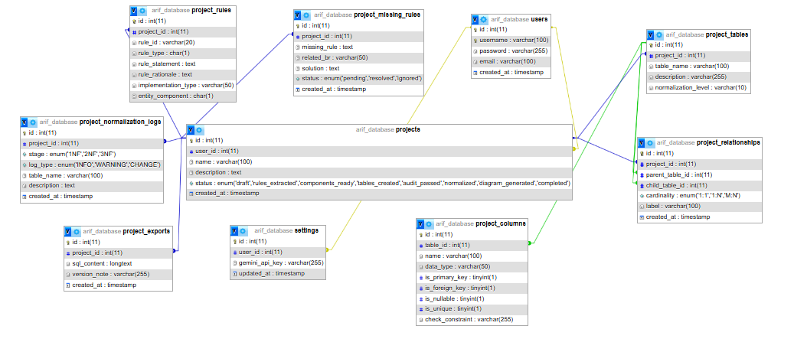

### Frontend Stack

The user interface prioritizes modern design principles and user experience:

- **Tailwind CSS**: Utility-first styling for rapid UI development
- **Lucide Icons**: Consistent and beautiful iconography
- **Vanilla JavaScript**: Lightweight, dependency-free interactions
- **Viz.js**: Advanced ER diagram rendering with Graphviz
- **SVG Pan Zoom**: Interactive diagram navigation

### Key Design Patterns

1. **Service Layer Pattern**: The `GeminiService` class encapsulates all AI interactions
2. **API-First Architecture**: Stages Consume API rather write PHP script into Page ,Seperated Logic to Request & Response style
3. **Progressive Enhancement**: Each stage builds upon the previous one , that allow to ai seperate tasks and give better solutions
4. **Error Resilience**: Automatic retry logic for AI service overload scenarios

###  Projects Page 

Users Can List View Their Projects & Work on multiple Projects from one account

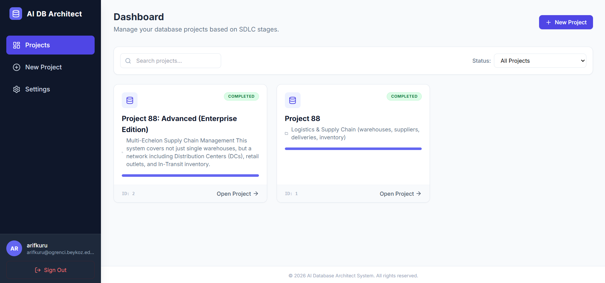


## The Seven-Stage Pipeline

### Stage 1: Project Initialization

Users begin by providing a natural language description of their project. The system accepts descriptions in various formats—from simple bullet points to comprehensive business requirement documents.

```php
{
  "name": "E-Commerce Platform",
  "domain": "Retail",
  "description": "An online store where customers can browse products,
                  add items to cart, place orders, and make payments..."
}
```
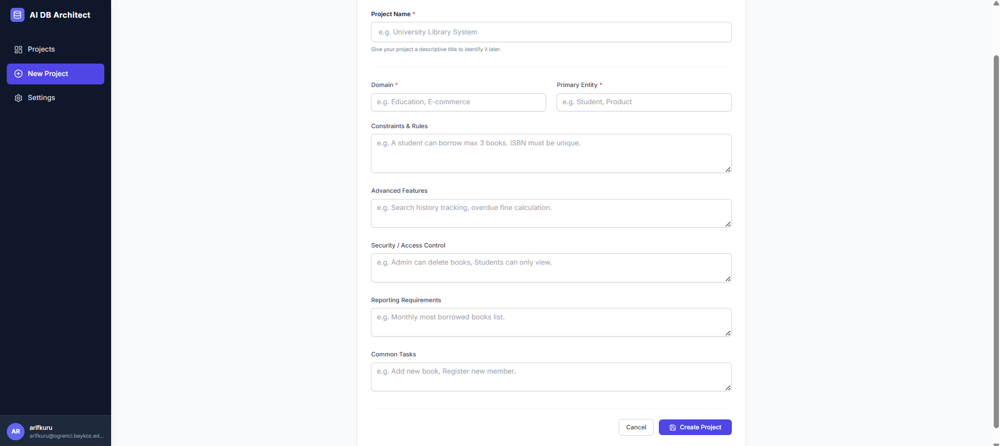


### Stage 2: Business Rule Extraction

This is where the AI magic begins. The `GeminiService` analyzes the project description and extracts structured business rules using sophisticated prompt engineering:

**Rule Classification System:**
- **Structural (S)**: Define entities and their core attributes
- **Operational (O)**: Describe business processes and workflows
- **Threshold (T)**: Specify limits and constraints
- **Authorization (Y)**: Define access control requirements

**Entity Component Analysis:**
- **E**: Entity definitions
- **R**: Relationship identifications
- **A**: Attribute specifications
- **C**: Constraint declarations

**Implementation Type Mapping:**
The AI determines how each rule should be implemented:
- Primary/Foreign Keys
- Database Triggers
- Application-level Constraints
- Access Control Mechanisms
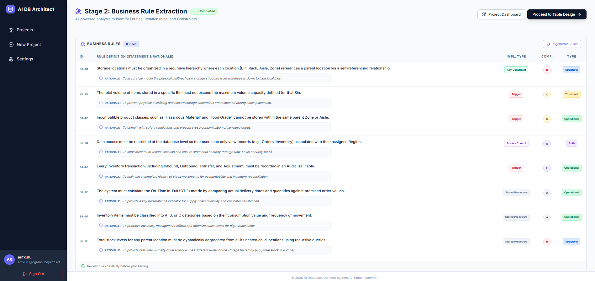

### Stage 3: Table Design Generation

Based on the extracted rules, the AI generates an initial database schema. This stage creates the foundational structure:

```php
// Example generated table structure
{
  "table_name": "customers",
  "columns": [
    {"name": "customer_id", "type": "INT", "is_primary": true},
    {"name": "email", "type": "VARCHAR(255)", "is_unique": true},
    {"name": "full_name", "type": "VARCHAR(100)", "is_nullable": false}
  ]
}
```
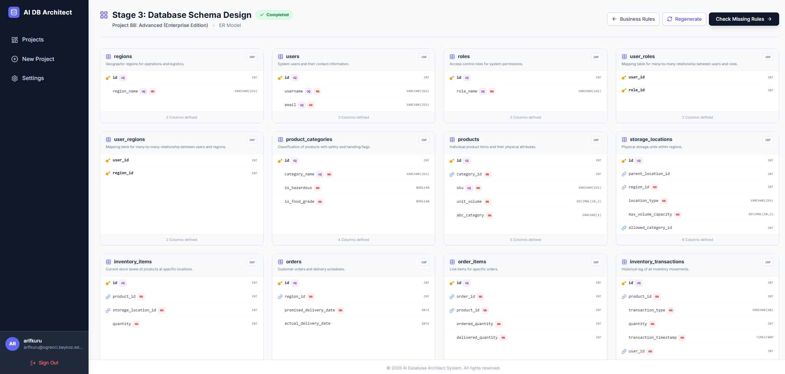

### Stage 4: Intelligent Audit

Before normalization, the system performs an automated audit to identify potential issues:

- Missing Primary Keys
- Inappropriate data types
- Constraint violations
- Orphaned relationships

The audit system provides actionable recommendations, ensuring the schema meets minimum quality standards before proceeding.
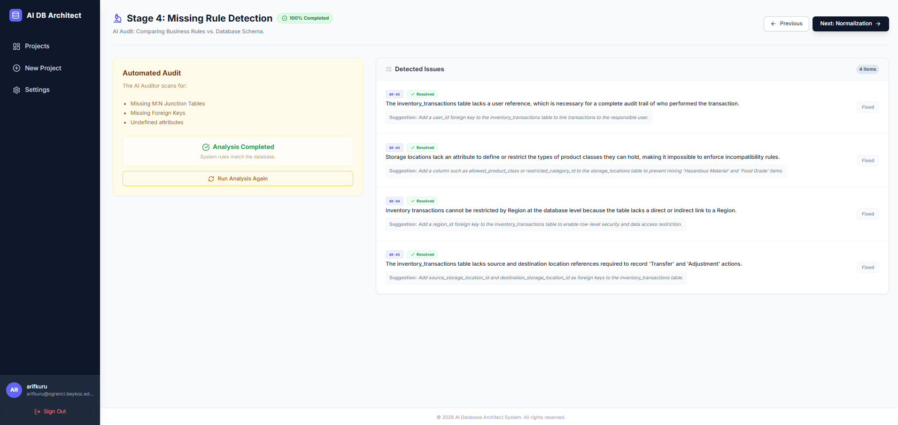

### Stage 5: Three-Step Normalization

The platform implements a rigorous normalization process:

#### First Normal Form (1NF)
- Eliminates repeating groups
- Ensures atomic values
- Creates separate tables for multi-valued attributes

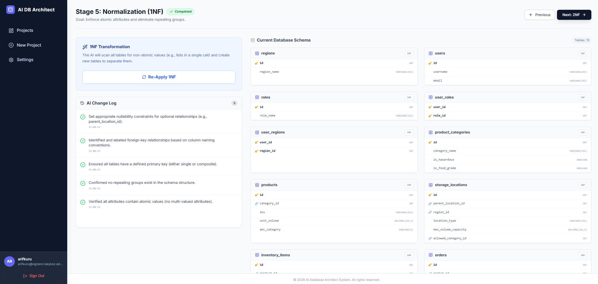

#### Second Normal Form (2NF)
- Removes partial dependencies
- Ensures all non-key attributes depend on the entire primary key
- Particularly critical for composite key tables

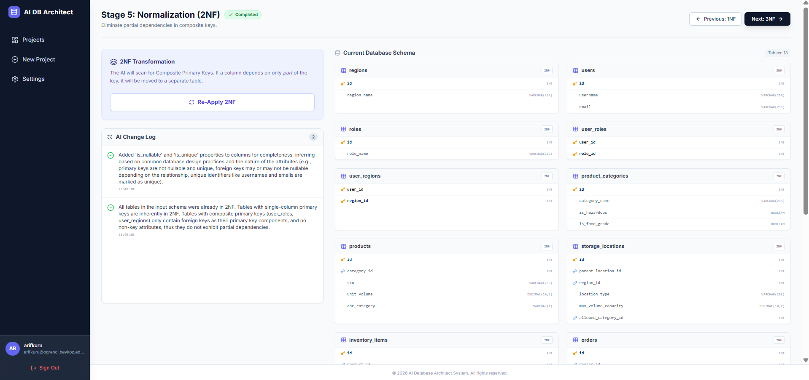

#### Third Normal Form (3NF)
- Eliminates transitive dependencies
- Ensures non-key attributes depend only on the primary key
- Creates lookup tables where necessary
- 


Each normalization step is logged, providing transparency and allowing developers to understand the transformations applied to their schema.

### Stage 6: ER Diagram Visualization

The platform generates beautiful, interactive Entity-Relationship diagrams using Crow's Foot notation:

**Features:**
- **Interactive Pan & Zoom**: Navigate large schemas effortlessly
- **Visual Differentiation**: Color-coded primary keys, foreign keys, and regular attributes
- **Cardinality Display**: Clear 1:1, 1:N, and M:N relationship indicators
- **Export Capabilities**: Download diagrams in Draw.io format for further customization

The diagram generation uses Graphviz's DOT language, carefully constructing HTML-like table nodes with proper styling:

```javascript
// Sophisticated DOT generation with proper escaping
function generateDot(tables, relationships) {
  let dot = `digraph ER {
    graph [rankdir=LR, splines=polyline, nodesep=0.6];
    // ... table and relationship definitions
  }`;
  return dot;
}
```
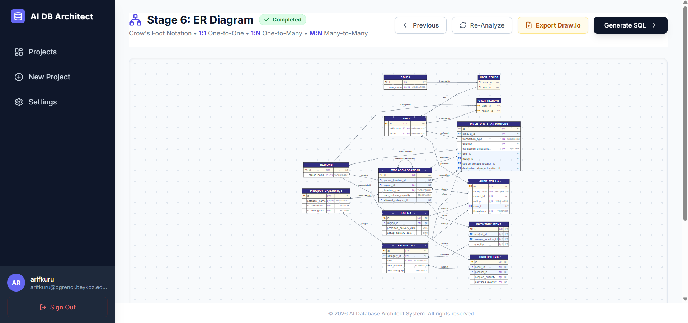

### Stage 7: SQL Generation

The final stage produces production-ready SQL scripts:

- **CREATE TABLE** statements with proper data types
- **Primary Key** declarations
- **Foreign Key** constraints with ON DELETE/ON UPDATE clauses
- **Index** creation for performance optimization
- **Comments** for documentation

Users can download the complete SQL file and deploy it immediately to their database servers.


## The AI Engine: GeminiService

At the heart of the platform lies the `GeminiService` class, a sophisticated wrapper around Google's Gemini API:


### Key Features

**1. User-Specific API Keys**
```php
// Each user provides their own Gemini API key
// Stored securely in the settings table
$this->apiKey = $settings['gemini_api_key'];
```
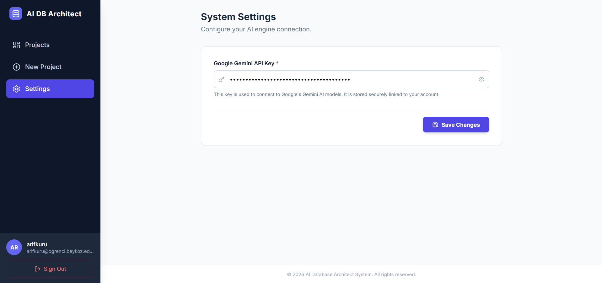


**2. Intelligent Retry Mechanism**
```php
$maxRetries = 3;
while ($attempt < $maxRetries) {
  // Handle API overload gracefully
  if ($httpCode === 503) {
    sleep(2);
    continue;
  }
}
```

**3. JSON Mode for Structured Output**
```php
if ($jsonMode) {
  $postData['generationConfig']['response_mime_type'] = 'application/json';
}
```

**4. Prompt Engineering Excellence**

The system instruction is carefully crafted to ensure consistent, high-quality output:

```php
$systemInstruction = "You are an expert Database Architect. 
Your task is to analyze project descriptions and extract structured 
Business Rules, Entities, and Attributes. You must strictly follow 
3NF normalization principles.";
```

## Security Considerations

The platform implements multiple security layers:

### 1. SQL Injection Prevention
```php
// Using PDO prepared statements throughout
$stmt = $db->prepare("SELECT * FROM projects WHERE id = ? AND user_id = ?");
$stmt->execute([$project_id, $user_id]);
```

### 2. Authentication & Authorization
- Session-based authentication
- User-specific data isolation
- CSRF protection mechanisms

<table>
  <tr>
    <td align="center">
      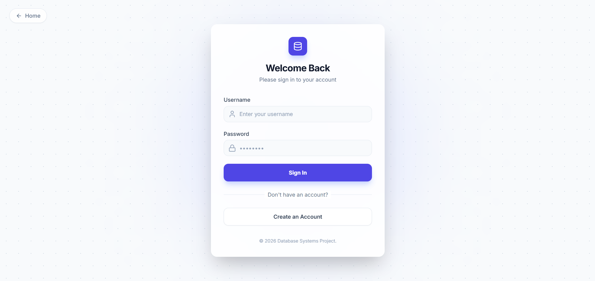
    </td>
    <td align="center">
      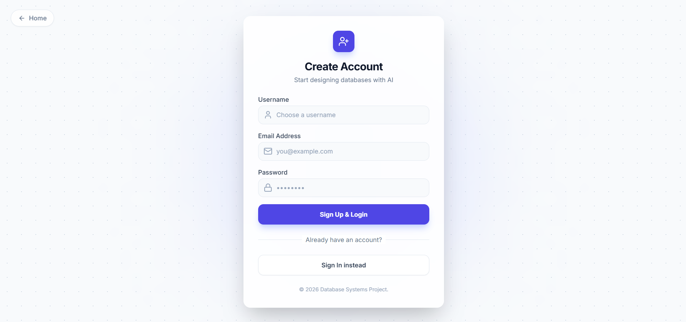
    </td>
  </tr>
  <tr>
    <td align="center"><strong>Login</strong></td>
    <td align="center"><strong>Register</strong></td>
  </tr>
</table>


### 3. API Key Security
- User API keys stored encrypted
- Never exposed in client-side code
- Server-side validation on every request

### 4. Input Sanitization
```php
// Proper HTML escaping
echo htmlspecialchars($rule['rule_statement']);
```

## User Experience Design

The interface is designed with developer productivity in mind:

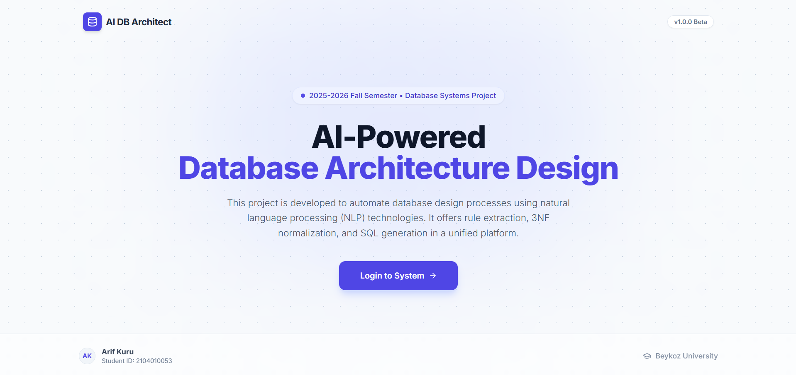


### Modern UI Patterns

**1. Status Badges**: Clear visual indicators of project progress
```html
<span class="bg-green-100 text-green-700 border-green-200">
  ✓ Completed
</span>
```

**2. Progressive Disclosure**: Information revealed as needed
- Collapsed views for table listings
- Expandable rationale for business rules
- Hover tooltips for technical details

**3. Loading States**: Every async operation provides feedback
```javascript
btn.innerHTML = `<i class="animate-spin">⟳</i> Processing...`;
```

**4. Error Handling**: User-friendly error messages
```javascript
if (!data.success) {
  alert('AI Error: ' + data.message);
}
```

## Real-World Use Cases

### E-Commerce Platform
Input: "Build an online store with products, customers, orders, and payments"

Output: Fully normalized schema with:
- Customer authentication tables
- Product catalog with categories
- Shopping cart functionality
- Order processing tables
- Payment transaction logs

### Library Management System
Input: "Manage books, members, borrowing, and returns with late fees"

Output: Complete database design including:
- Book inventory tables
- Member management
- Transaction history
- Fine calculation tables

### Hospital Management
Input: "Track patients, doctors, appointments, and medical records"

Output: HIPAA-consideration ready schema with:
- Patient information tables
- Medical staff management
- Appointment scheduling
- Medical record storage

## Performance Optimizations

### 1. Lazy Loading
- Tables and columns loaded on demand
- Pagination for large project lists

### 2. Client-Side Caching
```javascript
// Debounced search to reduce API calls
function debounceSearch() {
  clearTimeout(searchTimeout);
  searchTimeout = setTimeout(() => fetchProjects(1), 300);
}
```

### 3. Database Indexing
- Composite indexes on frequently queried columns
- Foreign key indexes for join optimization

### 4. Efficient AI Usage
- Single API call for rule extraction
- Batch processing for normalization steps
- Result caching to avoid redundant calls

## Challenges & Solutions

### Challenge 1: JSON Parsing Reliability
**Problem**: Gemini occasionally returned markdown-wrapped JSON
```json
```json
{"entity": "User"}
```
```

**Solution**: Implemented robust JSON cleaning
```php
private function cleanJson($text) {
  $text = preg_replace('/^```json\s*/i', '', $text);
  $text = preg_replace('/\s*```$/', '', $text);
  return trim($text);
}
```

### Challenge 2: Complex ER Diagram Rendering
**Problem**: Large schemas crashed the browser

**Solution**: Implemented SVG pan/zoom with viewport optimization
```javascript
panZoomInstance = svgPanZoom('#er-svg', {
  zoomEnabled: true,
  fit: true,
  center: true
});
```

### Challenge 3: Normalization Accuracy
**Problem**: AI sometimes missed subtle dependencies

**Solution**: Multi-pass analysis with explicit dependency checking
- First pass: Obvious violations
- Second pass: Transitive dependency analysis
- Third pass: Validation and confirmation

## Future Enhancements
## 0 is Essential Others Optional & Future Ideas
### 0. CRUD Operations for each stage 
 - This project like MVP version so it's require essential for daily use CRUD operations for each stage to Adjust small changes apart from AI
### 1. Multi-Database Support
- PostgreSQL export
- MongoDB schema generation
- SQLite for prototyping

### 2. Version Control
- Schema versioning
- Migration script generation
- Rollback capabilities

### 3. Team Collaboration
- Shared projects
- Comment system for rules
- Approval workflows

### 4. Advanced AI Features
- Query optimization suggestions
- Index recommendations based on usage patterns
- Automatic denormalization for read-heavy workloads

### 5. Integration Capabilities
- REST API for external tools
- CI/CD pipeline integration
- Direct database deployment

## Conclusion

AI Database Architect shows that AI can be used to speed up database design without compromising design quality.
The project focuses on making database schema generation more efficient and accessible by automating core design steps.

## Technical Stack Summary

| Layer | Technologies |
|-------|-------------|
| **Frontend** | Tailwind CSS, Vanilla JS, Lucide Icons |
| **Backend** | PHP 8.x, PDO/MySQL |
| **AI Engine** | Google Gemini 2.5 Flash Lite |
| **Visualization** | Viz.js (Graphviz), SVG Pan Zoom |
| **Architecture** | MVC Pattern, RESTful APIs |

---

## Getting Started

### Prerequisites
- PHP 8.0 or higher
- MySQL 5.7 or higher
- Web server (Apache/Nginx)
- Google Gemini API Key

### Installation
1. Clone the repository
2. Import the database schema from `instance.sql`
3. Configure database credentials in `config/db.php`
4. Register an account and add your Gemini API key in Settings
5. Start designing your database!

---

*This project showcases the intersection of artificial intelligence and traditional database theory, proving that automation and best practices can coexist harmoniously.*
